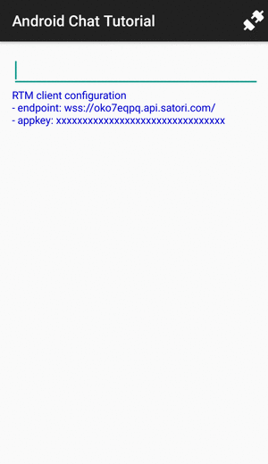

# Satori RTM Android Chat Tutorial

This chat application uses Satori RTM and covers the following topics:

* Connecting to Satori RTM
* Subscribing to a channel
* Processing subscription data (messages)
* Publishing to a channel
* Handling network errors

## Run the app

After Android Studio project has been successfully imported and Gradle build has synced, you should do the following steps:

1. Click **Run** (or **Debug**) button in the toolbar. This brings up **Select Deployment Target** window.
1. If you connected a physical Android device or added a virtual one (emulator), choose it from the list. Otherwise, you can install a new virtual device from the **Select Deployment Target** window. Click **Create New Virtual Device** and follow the steps in the wizard. For more information, see the [Google AVD instructions](https://developer.android.com/studio/run/managing-avds.html#viewing).

Android Studio installs the app on the device and starts it.

**Note:** This tutorial application uses the standard Android Studio setup. However, you may experience difficulties with Android development and Gradle. If you have any problems, check out the [Android Studio User Guide](https://developer.android.com/studio/run/index.html).

